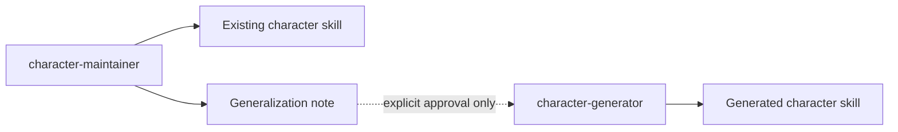

# Production And Maintenance Skill Relationships

## Relationship Rules

- `character-generator` creates initial skill scaffolds.
- `character-maintainer` evolves existing character folders.
- Maintainer may recommend generator changes, but should not make them during a normal character patch.
- Generator changes require explicit scope and approval.
- The diagram describes roles, not platform ownership. Current exposures are declared in `workspace_manifest.yaml`.
