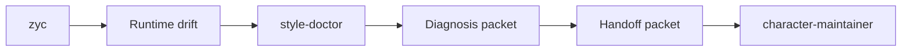

# Runtime Diagnosis And Maintenance Relationships

## Relationship Rules

- `zyc` is used at runtime.
- `style-doctor` diagnoses failures.
- `style-doctor` may create diagnosis and handoff packets, but it does not patch source files or update the patch ledger.
- Maintainer patches require the `character-maintainer` authority and `source_patch` execution mode, regardless of platform.
- Generator changes are a later explicit decision.
- Current platform exposures are deployment facts in `workspace_manifest.yaml`, not ownership rules.
